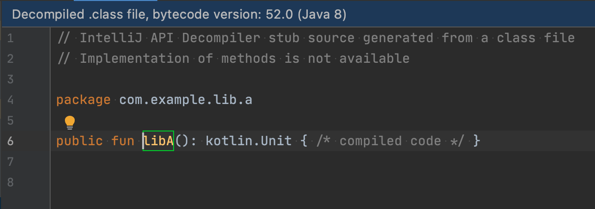

1. From the repository root, run `cd projectA && ./gradlew publishToMavenLocal`.
2. Open `./projectB/` in Android Studio (note: this is not the repo root, but a subdirectory).
3. Open LibB.kt (`src/main/java/com/example/lib/b/LibB.kt`).
4. Point cursor at `libA()` and 'Jump to Source' (usually middle mouse click or (on MacOS) ⌘ + click or ⌘ + B).
5. 🐛 Notice that the sources aren't there, you're looking at a decompiled .class file instead.

